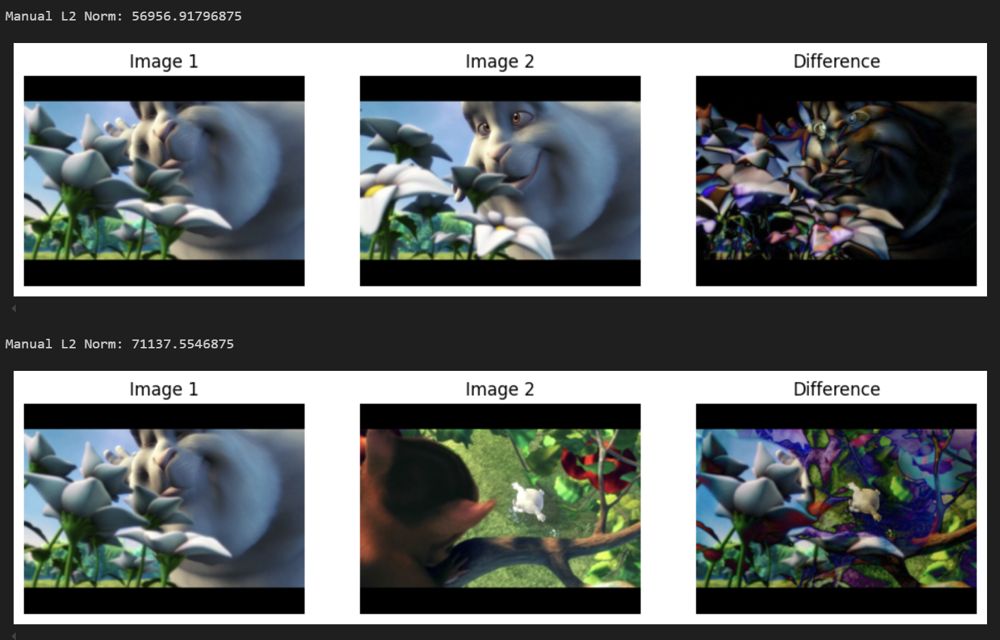

# 📸 Thumbnail Generator (GIF) from Video

## Overview

When sharing videos—especially for marketing—**thumbnails matter**. They’re the first thing people see before clicking. A good thumbnail helps grab attention and increase engagement. But manually finding the best frame in a video is time-consuming and subjective.

This project solves that problem by automatically **generating attention-grabbing GIF thumbnails** from videos. It uses smart keyword detection to pick the most relevant scenes and turn them into a GIF. All of this is handled by a responsive Python API.

---

## 🚀 Features

- 🎥 Accepts video input (upload or URL)
- ⚡ Fast, asynchronous processing with FastAPI
- 🧠 Uses AI (CLIP model) to understand what's in the video
- 🔍 Filters scenes using your chosen keyword
- ✂️ Efficient chunking and scene comparison
- 🖼️ Outputs a looped GIF thumbnail

---

## 💡 How It Works

1. Upload a video or provide a link.
2. The system breaks the video into chunks.
3. It analyzes each chunk using AI to understand the content.
4. You provide a **keyword** like `"laptop"` or `"smile"`.
5. The system compares each chunk with the keyword and keeps only the relevant ones (with at least **70% similarity**).
6. The relevant chunks are combined into a GIF thumbnail.

---

## 🧰 Requirements

- Python 3.8 or higher
- pip
- Internet connection (for downloading models if needed)

Install dependencies:

```bash
pip install -r requirements.txt
```

## ⚙️ How to Run
1. Clone the repository:

```bash
git clone https://github.com/ahmad20/thumnbnail-generator.git
cd thumbnail-generator
```

2. Run the server:

```bash
uvicorn main:app --reload
```

3. Use the following curl command to generate a GIF thumbnail from a video URL:

```bash
curl -X POST "http://localhost:8000/generate_thumbnail" \
-H "Content-Type: application/json" \
-d '{
  "url": "https://www.sample-videos.com/video321/mp4/720/big_buck_bunny_720p_5mb.mp4",
  "keywords": ["rabbit"]
}'
```
Use the API interface to upload a video, enter a keyword, and generate your GIF thumbnail.

## 📝 Example Use Case
Let’s say you have a 5-minute product demo video. You want a thumbnail that shows someone using the product. Just enter the keyword "rabbit" and the system will scan the video, find matching scenes, and generate a short GIF of the best frames.


This GIF can then be used in emails, websites, or social media to boost engagement.

## 📦 Output
The final GIF will be saved in a thumbnails/ folder and can also be downloaded via the API.

## 🙌 Contributions
Have ideas to make it better? Want to add features like MP4 output or multiple keywords? Contributions are welcome! Feel free to fork the repo and submit a pull request.

## 🧠 Tech Details (for developers)
- FastAPI + Uvicorn for asynchronous API
- ThreadPoolExecutor to speed up video chunk processing
- CLIPProcessor + CLIPModel from HuggingFace Transformers for semantic similarity. [Read the documentation]('https://huggingface.co/docs/transformers/en/model_doc/clip')
- L2 norm to compare video chunk embeddings
- Pillow (PIL) to generate GIFs
- Made with ❤️ using Python.
